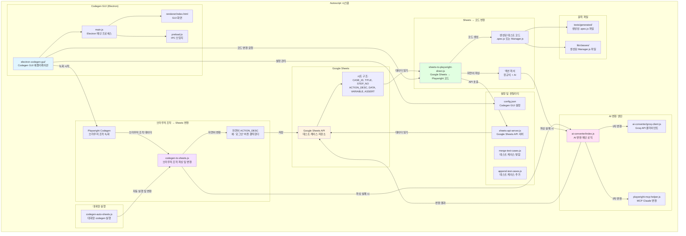

# Autoscript 시스템 구성도

## 주요 컴포넌트 설명

### 1. Codegen GUI (Electron)
- **electron-codegen-gui/**: 브라우저 조작 녹화 및 코드 변환을 위한 GUI 애플리케이션
- **main.js**: Electron 메인 프로세스, IPC 핸들러 처리
- **renderer/index.html**: 사용자 인터페이스
- **preload.js**: 안전한 IPC 브릿지

### 2. 브라우저 조작 → Sheets 변환
- **Playwright Codegen**: 브라우저에서 직접 조작한 내용을 녹화
- **codegen-to-sheets.js**: 브라우저 조작 데이터를 파싱하여 Google Sheets 형식으로 변환
- 자연어 기반 ACTION_DESC 생성

### 4. AI 변환 엔진
- **ai-converter/index.js**: AI 변환 메인 로직
- **groq-client.js**: Groq API를 통한 빠른 변환 (1차)
- **playwright-mcp-helper.js**: MCP Claude Sonnet 4를 통한 고정밀 변환 (2차)
- 정규식 파싱 실패 시 자동으로 AI 변환 수행

### 5. Google Sheets
- 테스트 케이스 중앙 저장소
- 구조: CASE_ID, TITLE, STEP_NO, ACTION_DESC, DATA, VARIABLE, ASSERT
- 제품별 시트 탭 (TROMBONE, VIOLA, CONTRABASS, CMP)

### 6. Sheets → 코드 변환
- **sheets-to-playwright-direct.js**: Google Sheets 데이터를 Playwright 코드로 변환
- 자연어 ACTION_DESC를 Playwright 코드로 파싱
- .spec.js 파일 또는 Manager 클래스 생성

### 7. 대화형 실행
- **codegen-auto-sheets.js**: 대화형으로 codegen 실행 및 자동 변환

### 8. 설정 및 유틸리티
- **config.json**: Codegen GUI 설정 (제품별 URL, Google Sheets ID 등)
- **sheets-api-server.js**: Google Sheets API 서버
- **merge-test-cases.js**: 테스트 케이스 병합 유틸리티
- **append-test-cases.js**: 테스트 케이스 추가 유틸리티

## 데이터 플로우

1. **브라우저 조작 → Sheets**: Playwright Codegen으로 브라우저 조작 녹화 → codegen-to-sheets.js로 파싱 및 자연어 변환 → Google Sheets 저장
2. **Sheets → 코드**: sheets-to-playwright-direct.js로 Sheets 데이터 읽기 → 자연어 파싱 → 테스트 코드 생성
3. **AI 변환**: 파싱 실패 시 Groq API → MCP Claude 순서로 자동 변환

