# Electron 애플리케이션 구성도

```mermaid
graph TB
    subgraph "Electron 애플리케이션"
        subgraph "메인 프로세스"
            MainProcess["main.js<br/>Electron 메인 프로세스"]
            MainProcess --> |초기 로드| ProductSelector["product-selector.html<br/>제품 선택 화면"]
        end
        
        subgraph "제품 선택"
            ProductSelector --> |제품 선택| SelectTrombone["TROMBONE 선택"]
            ProductSelector --> |제품 선택| SelectViola["VIOLA 선택"]
            ProductSelector --> |제품 선택| SelectContrabass["CONTRABASS 선택"]
            ProductSelector --> |제품 선택| SelectCMP["CMP 선택"]
        end
        
        subgraph "제품별 GUI 화면"
            TromboneGUI["TROMBONE/<br/>trombone-main.html"]
            ViolaGUI["VIOLA/<br/>viola-main.html"]
            ContrabassGUI["CONTRABASS/<br/>contrabass-main.html"]
            CMPGUI["CMP/<br/>cmp-main.html<br/>(예시: 상세 구조)"]
            
            SelectTrombone --> TromboneGUI
            SelectViola --> ViolaGUI
            SelectContrabass --> ContrabassGUI
            SelectCMP --> CMPGUI
        end
        
        subgraph "CMP 제품 상세 구조 예시"
            subgraph "렌더러 프로세스 GUI"
                CMPGUI --> |시나리오 선택| ScenarioSelect["시나리오 선택 UI"]
                CMPGUI --> |실행 버튼 클릭| RunBtn["실행 버튼"]
                CMPGUI --> |로그 확인| LogView["실시간 로그 뷰어"]
                CMPGUI --> |이력 관리| HistoryTab["이력 관리 탭"]
            end
            
            subgraph "메인 프로세스 IPC"
                IPC["IPC 핸들러<br/>- generate-custom-report<br/>- run-scenario<br/>- open-custom-report"]
            end
            
            subgraph "테스트 실행 엔진"
                Runner["electron-scenario-runner.js<br/>시나리오 실행 엔진"]
                Runner --> |Playwright 실행| Playwright["Playwright<br/>브라우저 자동화"]
            end
            
            subgraph "테스트 파일"
                SpecFiles["tests/scenario/<br/>scenario-*.spec.js"]
                SpecFiles --> |테스트 케이스 실행| TestCases["테스트 케이스"]
            end
            
            subgraph "Manager 클래스"
                BaseMgr["lib/classes/<br/>BaseManager.js"]
                LoginMgr["lib/classes/<br/>LoginManager.js"]
                ProductMgr["lib/classes/<br/>제품별 Manager"]
                BaseMgr --> |상속| LoginMgr
                BaseMgr --> |상속| ProductMgr
                TestCases --> |사용| LoginMgr
                TestCases --> |사용| ProductMgr
            end
            
            subgraph "리포트 생성"
                ReportGen["lib/report-generator.js<br/>리포트 생성 엔진"]
                ReportGen --> |HTML 생성| CustomReport["custom-reports/<br/>커스텀 리포트"]
            end
            
            subgraph "설정 파일"
                Config["config/<br/>test-settings.json"]
                Config --> |설정 로드| Runner
                Config --> |설정 로드| ReportGen
            end
            
            subgraph "데이터 저장"
                GlobalResults["custom-reports/<br/>global-test-results.json"]
            end
            
            RunBtn --> |IPC 호출| IPC
            IPC --> |시나리오 실행| Runner
            Runner --> |테스트 파일 로드| SpecFiles
            Playwright --> |테스트 결과| GlobalResults
            Runner --> |테스트 완료| IPC
            IPC --> |리포트 생성 요청| ReportGen
            ReportGen --> |리포트 데이터 읽기| GlobalResults
            ReportGen --> |리포트 저장| CustomReport
            IPC --> |로그 전달| LogView
            IPC --> |이력 업데이트| HistoryTab
        end
        
        subgraph "다른 제품들 동일 구조"
            Note["TROMBONE, VIOLA, CONTRABASS도<br/>CMP와 동일한 구조를 가짐<br/>- 각 제품별 main.html<br/>- electron-scenario-runner.js<br/>- lib/report-generator.js<br/>- tests/scenario/<br/>- config/test-settings.json"]
        end
    end
    
    style MainProcess fill:#e1f5ff
    style ProductSelector fill:#fff4e1
    style CMPGUI fill:#ffe1f5
    style IPC fill:#fff4e1
    style Runner fill:#ffe1f5
    style ReportGen fill:#e1ffe1
    style Playwright fill:#f5e1ff
    style Note fill:#f0f0f0
```

## 주요 컴포넌트 설명

### 1. 메인 프로세스
- **main.js**: Electron 메인 프로세스, 애플리케이션 초기화 및 IPC 핸들러 관리
- **product-selector.html**: 제품 선택 화면, 사용자가 TROMBONE, VIOLA, CONTRABASS, CMP 중 하나를 선택

### 2. 제품별 GUI 화면
- 각 제품은 독립적인 HTML 파일을 가짐 (예: cmp-main.html, viola-main.html 등)
- 제품 선택 시 해당 제품의 main.html 파일로 이동

### 3. CMP 제품 상세 구조 (예시)

#### 3.1 렌더러 프로세스 (GUI)
- **cmp-main.html**: Electron GUI 메인 화면
- 시나리오 선택, 실행 버튼, 실시간 로그 뷰어, 이력 관리 기능 제공

#### 3.2 메인 프로세스 (IPC)
- IPC 핸들러를 통해 렌더러와 메인 프로세스 간 통신
- 리포트 생성, 시나리오 실행, 리포트 열기 등 핵심 기능 처리

#### 3.3 테스트 실행 엔진
- **electron-scenario-runner.js**: 시나리오 실행을 담당하는 메인 엔진
- Playwright를 통해 브라우저 자동화 실행

#### 3.4 테스트 파일
- **tests/scenario/scenario-*.spec.js**: 각 시나리오별 테스트 파일
- Playwright 테스트 케이스 정의

#### 3.5 Manager 클래스
- **BaseManager.js**: 공통 기능 제공
- **LoginManager.js**, 제품별 Manager: 재사용 가능한 테스트 로직

#### 3.6 리포트 생성
- **lib/report-generator.js**: 커스텀 리포트 생성
- 테스트 결과를 HTML 형태로 변환

#### 3.7 설정 파일
- **config/test-settings.json**: 제품별 설정 정보

#### 3.8 데이터 저장
- **custom-reports/global-test-results.json**: 전역 테스트 결과 저장

### 4. 다른 제품들
- **TROMBONE, VIOLA, CONTRABASS**도 CMP와 동일한 구조를 가짐
- 각 제품별로 독립적인 폴더와 설정 파일을 가지며, 동일한 컴포넌트 구조를 사용
- 제품별 차이점은 설정 파일과 테스트 케이스 내용뿐

