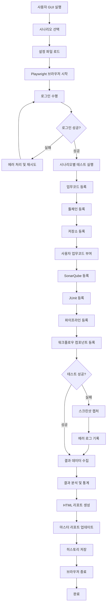
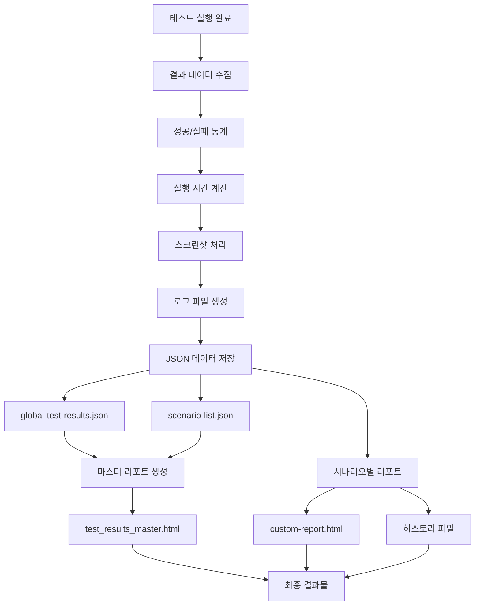
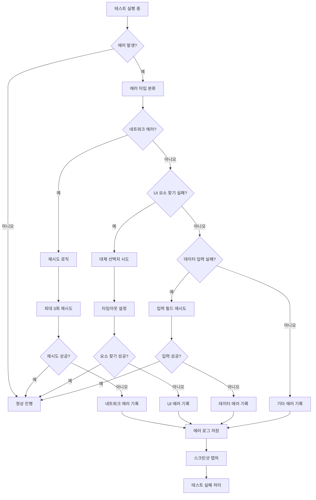
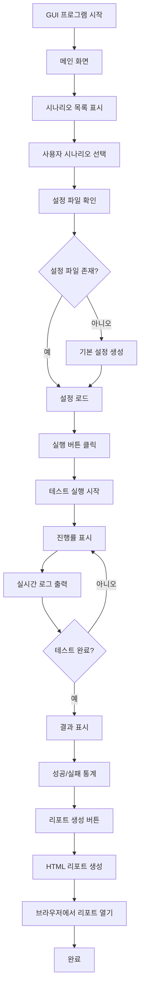
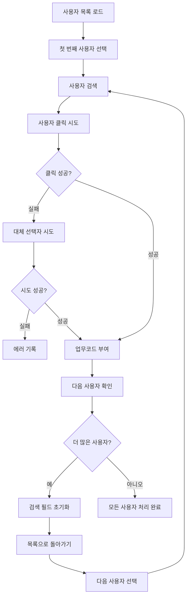
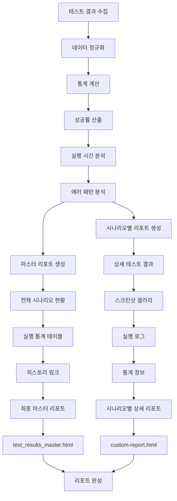
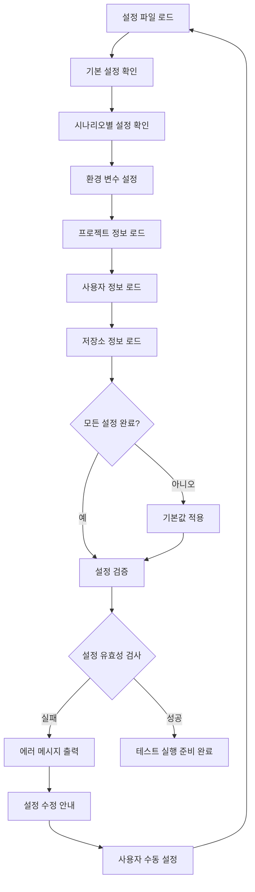

# TROMBONE UI 테스트 자동화 시스템 플로우 차트

## 1. 전체 시스템 플로우

## 2. 시나리오 실행 상세 플로우

```mermaid
flowchart LR
    A[시나리오 시작] --> B[기본 설정 로드]
    B --> C[환경 변수 설정]
    C --> D[Playwright 초기화]
    D --> E[브라우저 실행]
    E --> F[페이지 로드]
    F --> G[로그인 시도]
    G --> H{로그인 확인}
    H -->|실패| I[재시도 로직]
    I --> G
    H -->|성공| J[테스트 단계 실행]
    
    J --> K[단계 1: 업무코드]
    K --> L[단계 2: 툴체인]
    L --> M[단계 3: 저장소]
    M --> N[단계 4: 사용자]
    N --> O[단계 5: SonarQube]
    O --> P[단계 6: JUnit]
    P --> Q[단계 7: 파이프라인]
    Q --> R[단계 8: 워크플로우]
    
    R --> S{모든 단계 성공?}
    S -->|실패| T[실패 처리]
    S -->|성공| U[성공 처리]
    T --> V[결과 저장]
    U --> V
    V --> W[리포트 생성]
    W --> X[시나리오 완료]
```

## 3. 데이터 처리 플로우

## 4. 에러 처리 플로우

## 5. 사용자 인터페이스 플로우

## 6. 멀티 사용자 처리 플로우

## 7. 리포트 생성 플로우

## 8. 설정 관리 플로우

이러한 플로우 차트들은 TROMBONE UI 테스트 자동화 시스템의 전체적인 동작 과정을 시각적으로 보여줍니다. 각 차트는 시스템의 다른 측면을 다루며, 전체적인 이해를 돕습니다.
