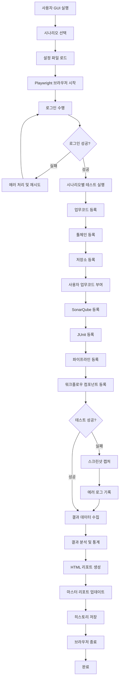
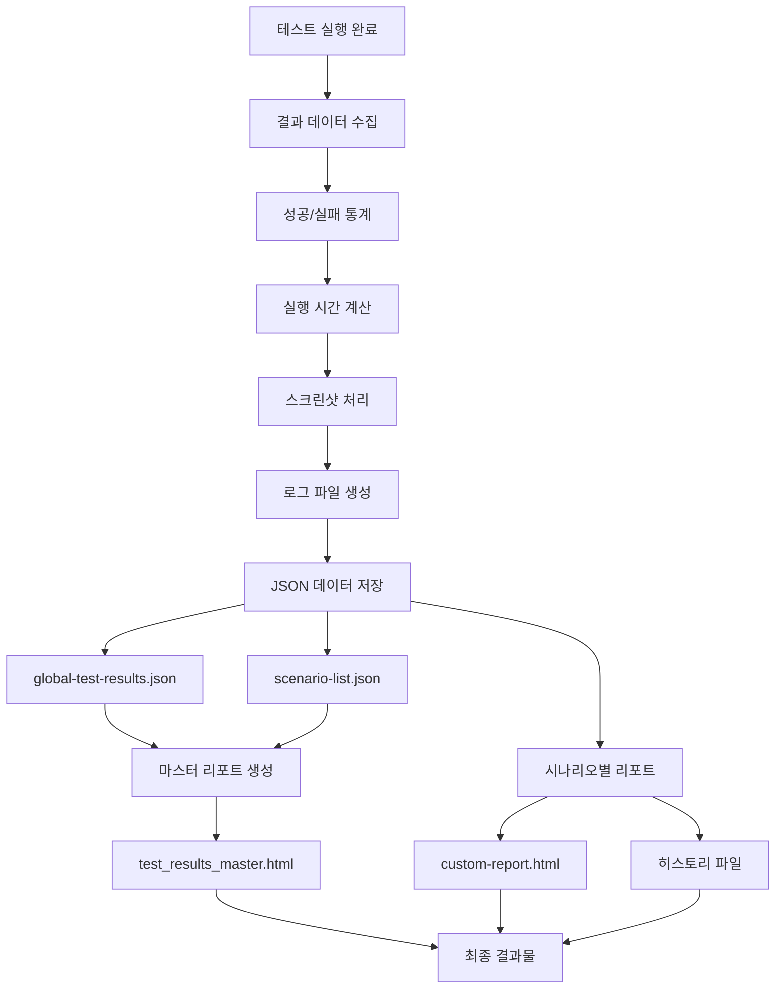
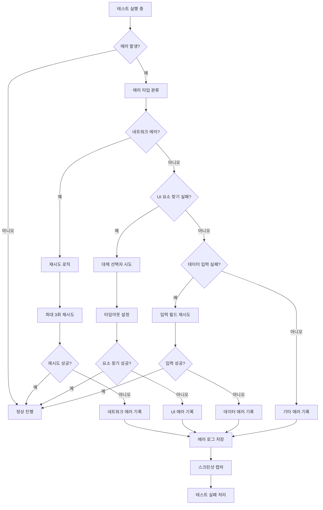

# TROMBONE UI 시나리오 테스트 자동화 보고서

## 목차
1. **프로젝트 개요**  
2. **프로젝트 폴더 구조**  
3. **통합 데이터 플로우**  
4. **시스템 플로우 차트**  
5. **주요 성과 및 특징**  
6. **향후 계획**  

---

## 1. 프로젝트 개요

### 1.1 프로젝트 목적
TROMBONE UI 테스트 자동화 시스템은 제품의 주요 테스트 시나리오를 자동화하여  
테스트 효율성을 높이고, 품질을 체계적으로 보장하는 것을 목적으로 합니다.

### 1.2 핵심 기술 스택
- **테스트 프레임워크**: Playwright
- **런타임 환경**: Node.js
- **데스크톱 GUI**: Electron(Playwright 제공)
- **보고서 생성**: HTML/CSS/JavaScript  
- **데이터 관리**: JSON  

### 1.3 주요 기능
- 21개 시나리오 자동화 지원  
- 테스트 실행 과정의 실시간 모니터링  
- 단계별 상세 결과 분석 및 리포트 제공  
- 실행 기록 이력 관리 및 추적  

### 1.4 실행 과정
```
GUI 프로그램 실행 → 시나리오 데이터 값 설정 → 시나리오 수행 · 모니터링 → 리포트 확인(결과 검증·통계)
```

---

## 2. 프로젝트 폴더 구조

```
uitest-trombone/
├── config/                          # 시스템 설정 및 환경 구성 파일들
│   ├── test-settings.json              # 기본 테스트 환경 설정
│   └── scenario/                       # 시나리오별 개별 설정 파일들 (시나리오 별로 필요한 데이터값을 정의)
│       ├── test-settings-1.json
│       ├── test-settings-2.json
│       └── ... (test-settings-21.json까지)
├── lib/                            # 핵심 기능 라이브러리 및 도구들
│   ├── classes/                       # 기능별 관리 클래스들 (각 기능을 정의)
│   │   ├── TaskCodeManager.js        
│   │   ├── RepositoryManager.js       
│   │   └── ... (지속적으로 추가될 예정)
│   └── report-generator.js            # 메인 리포트 생성 엔진
├── tests/                          # 실제 테스트 시나리오 파일들
│   ├── scenario/                      # 시나리오별 TC (시나리오 별로 필요한 실행을 원하는 순서대로 붙여넣기)
│   │   ├── scenario-1.spec.js
│   │   ├── scenario-2.spec.js
│   │   └── ... (scenario-21.spec.js까지)
│   ├── steps/                         # 기능별 단위테스트 파일들 (정의된 클래스에 대한 실행을 정의)
│   │   ├── junit.spec.js              
│   │   ├── pipeline.spec.js           
│   │   └── ... (지속적으로 추가될 예정)
│   ├── pipeline-stg.txt               # STG환경 파이프라인 설정
│   └── pipeline-prd.txt               # PRD환경 파이프라인 설정
├── custom-reports/                 # 사용자 정의 보고서 및 결과물들
│   ├── test_results_master.html       # 전체 시나리오 현황 마스터 리포트
│   ├── global-test-results.json       # 전체 테스트 결과 데이터베이스
│   ├── scenario-list.json             # 시나리오 목록 및 상태 정보
│   └── scenario-1/                    # 1번 시나리오의 상세 결과물들
│       ├── custom-report.html
│       └── custom-report-*.html       # 과거 실행 기록 히스토리 파일들
├── test-results/                   # Playwright 테스트 엔진이 생성한 원본 결과물들
├── playwright-report/              # Playwright가 자동 생성하는 기본 HTML 리포트
├── package.json                       # 프로젝트 의존성 및 스크립트 설정
├── playwright.config.js               # Playwright 테스트 엔진 설정
└── run-tests.js                       # 테스트 실행을 시작하는 메인 프로그램
```

---

## 3. 통합 데이터 플로우

### 3.1 설정 및 준비 단계
**시스템 요구사항 및 초기 설정**
- **Node.js v18 이상, npm v8 이상, 메모리 4GB 이상, 저장공간 2GB 이상**
- **시나리오별 데이터 값 정의 및 기본 설정 병합**
- **환경 변수 적용(프로젝트/사용자/저장소 정보 반영)**
- **총 21개 시나리오 구성(업무별 특화 케이스 포함)**
- **개발/스테이징/운영 환경에 따른 설정 분리**

### 3.2 실행 단계
**테스트 실행 및 모니터링**
- **Playwright 기본 설정 구성**
- **선택된 시나리오 실행 및 실시간 로깅**
- **현재까지 업무코드, 툴체인, 저장소, 사용자 티켓 역할 권한, SonarQube, JUnit, 파이프라인, 워크플로우 컴포넌트 등 자동화 완료**

### 3.3 결과 처리 단계
**데이터 수집 및 분석**
- **실행 데이터 수집 및 성공/실패 분석**
- **성공률 및 실행 시간 측정**
- **실패 케이스 원인 분석 및 로그/스크린샷 매핑**
- **오류 원인 분석 및 통계 산출**

### 3.4 보고서 생성 단계
**리포트 생성 및 이력 관리**
- **종합 마스터 리포트 생성**
- **시나리오별 상세 결과, 스크린샷, 실행 로그 제공**
- **성공률, 소요시간 등 주요 지표를 수치로 시각화**
- **실행 이력 관리 및 추적**

---

## 4. 시스템 플로우 차트

### 4.1 전체 시스템 플로우


### 4.2 시나리오 실행 상세 플로우

```mermaid
flowchart LR
    A[시나리오 시작] --> B[기본 설정 로드]
    B --> C[환경 변수 설정]
    C --> D[Playwright 초기화]
    D --> E[브라우저 실행]
    E --> F[페이지 로드]
    F --> G[로그인 시도]
    G --> H{로그인 확인}
    H -->|실패| I[재시도 로직]
    I --> G
    H -->|성공| J[테스트 단계 실행]
    
    J --> K[단계 1: 업무코드]
    K --> L[단계 2: 툴체인]
    L --> M[단계 3: 저장소]
    M --> N[단계 4: 사용자]
    N --> O[단계 5: SonarQube]
    O --> P[단계 6: JUnit]
    P --> Q[단계 7: 파이프라인]
    Q --> R[단계 8: 워크플로우]
    
    R --> S{모든 단계 성공?}
    S -->|실패| T[실패 처리]
    S -->|성공| U[성공 처리]
    T --> V[결과 저장]
    U --> V
    V --> W[리포트 생성]
    W --> X[시나리오 완료]
```


### 4.3 데이터 처리 플로우


### 4.4 에러 처리 플로우


---

## 5. 주요 성과 및 특징

### 5.1 기술적 성과 
- **테스트 효율성 향상**: 수동 15분 소요 작업을 자동화로 2분 이내로 단축
- **24/7 테스트 운영 가능**: 사람의 개입 없이 24시간 연속으로 테스트 수행
- **자동화율 90% 이상 목표**: 수동으로 수행하던 테스트를 자동화하여 20배의 효율성 향상 달성

### 5.2 비즈니스 가치
- **소프트웨어 품질 보장**: 개발 과정에서 발생할 수 있는 버그를 조기에 발견하여 품질 향상
- **객관적 데이터 기반의 품질 지표 확보**: 투명성 확보

### 5.3 시스템 특징
- **모듈화 설계로 확장성 확보**: 새로운 테스트 시나리오를 쉽게 추가할 수 있도록 설계
- **기능별 모듈 분리로 유지보수성 강화**: 각 기능별로 분리된 모듈 구조로 유지보수 효율성 극대화
- **직관적 GUI 제공으로 사용자 친화성 확보**: 사용하기 쉬운 사용자 인터페이스 제공

---

## 6. 향후 계획

### 6.1 단기 계획 (1-3개월)
- **성능 최적화**: 현재 테스트 실행 속도를 30% 더 향상시켜 효율성 증대
- **시나리오 자동화 완성**: TROMBONE v3.0.4 버전의 모든 시나리오 자동화 완성
- **대시보드(레포트) 고도화**: 실시간 모니터링 기능을 더욱 정교하게 발전

### 6.2 중기 계획 (3-6개월)
- **CI/CD 통합**: Jenkins, GitLab 등 개발 도구와 연동하여 자동화 파이프라인 구축
- **고급 분석**: 과거 데이터를 활용한 예측 분석 기능 개발

### 6.3 장기 계획 (6개월 이상)
- **SaaS 플랫폼**: 사업품질팀이 언제든지 사용할 수 있는 클라우드 기반 서비스 제공
- **오픈소스**: 플랫폼 품질팀 내부 커뮤니티에 기여할 수 있는 오픈소스 프로젝트로 발전
- **모바일 지원**: 원격 시스템을 이용하여 모바일 기기에서도 시나리오 수행이 가능하도록 지원

